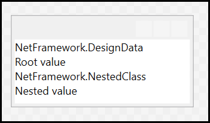
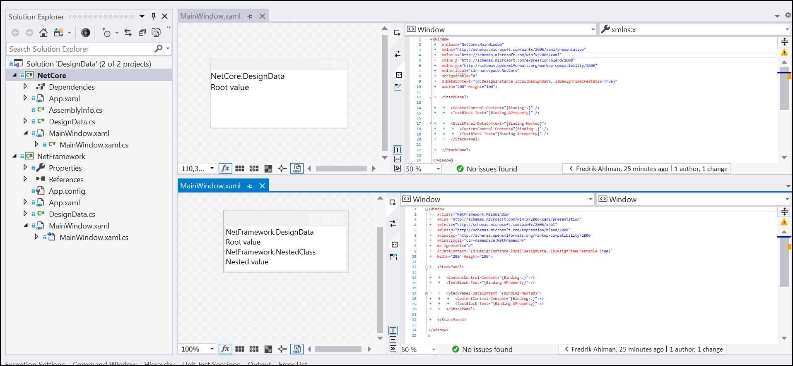

# DesignData not working correctly for .NET Core

The two applications (NetCore and NetFramework) looks the same when actually executed but they render differently during design-time.

## Design view of `MainWindow.xaml` for **.NET Framework v4.8**

## Design view of `MainWindow.xaml` for **.NET Core 3.1**

## View from VS 2019
(Top part is .NET Core 3.1 and bottom is Framework v4.8)

## Issue reported here
https://developercommunity.visualstudio.com/content/problem/1112239/wpf-datacontext.html